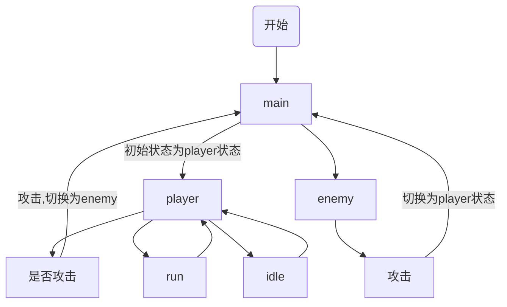

# 有限状态机简单应用

因为项目中有用到状态机，而自己并不是特别的了解，就是熟悉下状态机的应用和实用第三方javascript-state-machine v3版本
环境：Cocos Creator 2.1.1
第三方状态机的库：<https://github.com/kelykely/javascript-state-machine/tree/v3>

## 1 有限状态机

有限状态机（英语：finite-state machine，缩写：FSM）又称有限状态自动机，简称状态机，是表示有限个状态以及在这些状态之 间的转移和动作等行为的数学模型。

以上为百度百科中的定义，我认为最简单状态机其实就是switch...case

```JavaScript
    switch(state):{
        case "attack":
            xxx
            break
        case "run"   :
            xxx
            break
        case "idle"  :
            xxx
            break
    }
```

但是随着项目变得复杂，switch...case已不能满足，所以要使用状态机使项目更加的清晰，只关心当前状态的开或者关闭

## 2 状态转移表

每个状态机都应有一个状态转移表，使其更加的清晰。具体来说就是，某个状态通过什么条件可以转移到某一个状态，项目的例子中我使用了两个状态机，相互嵌套。

以下就是两个状态转移表

表1 总的状态转移表

|状态    |玩家状态    |敌人状态    |
|-------|------      |---        |
|玩家状态|  x        | 玩家攻击结束|  
|敌人状态|敌人攻击结束|     x      |

表2 玩家状态转移表

|状态    |攻击状态|待机状态|移动状态|
|-------|------  |---     |----   |
|攻击状态|  x     | 攻击结束|  攻击结束|
|待机状态|点击攻击按钮|x|点击移动按钮|
|移动状态|点击攻击按钮|x|x|

$
主状态机main=
\begin{cases}
 \text{player}\\
 \text{enemy}
\end{cases}
$
$
子状态机player=
\begin{cases}
 \text{攻击attack}\\
 \text{待机idle}\\
 \text{移动run}
\end{cases}
$




## 3 玩家